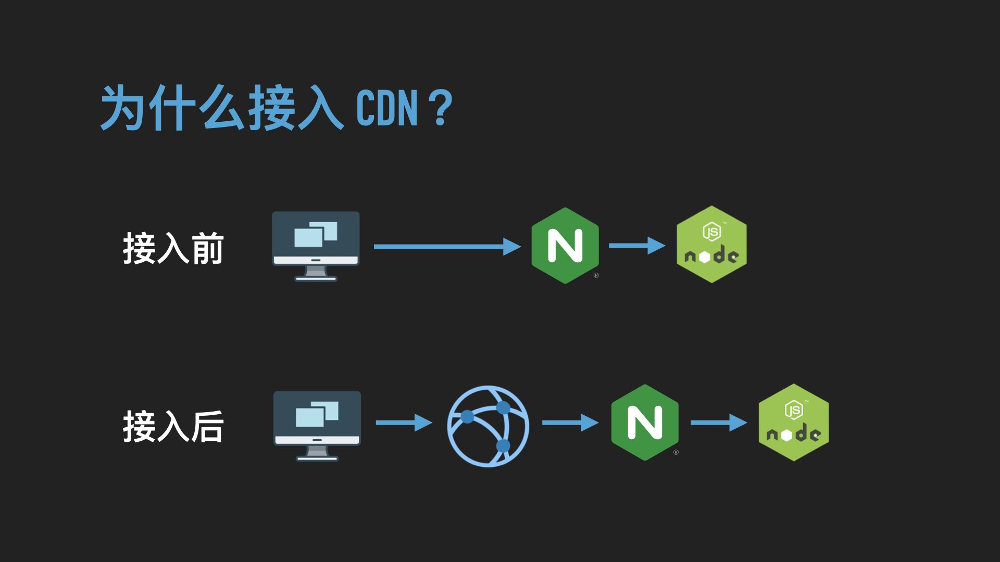
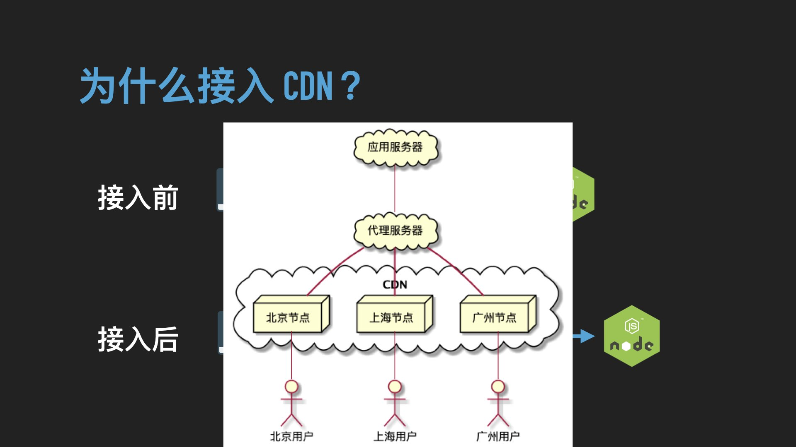

# Vue SSR 性能优化实践

先做一段简单的自我介绍吧，我来自微医的前端团队，目前专注于 Node.js 基础生态建设和各种解决方案的落地。三年前我开始从事 Node.js 服务端开发，去年慕名加入前端大家庭，有缘成为了一名前端工具人的工具人儿。

估计大部分读者对标题中的性能优化更感兴趣，可惜我分享的重点其实更多在于实践。实践有深有浅，下面介绍的时候会存在比较大的侧重。当然，篇幅不代表难易程度，考虑到不少信息已经有非常棒的公开资料，对这一部分我只会简单提起关键词，希望能起到抛砖引玉的作用。

本次分享围绕着 Vue SSR 和相关业务增长的背景，向大家展示我们做过了哪些尝试，以及一些踩坑经历，希望能给中小规模的团队带来一定的参考价值。

对于大型团队来说，这里基础的优化可能已经习以为常。并且许多人为了榨干机器性能，追求极致，已经有了各式各样的成功探索。我们从中学习到了很多思路，但不管是多么优秀的想法，多多少少也有着各自的局限性，适合他们的不一定适合我们。

受限于分享人的经验和水平，本文大多是从 Server 的角度思考如何解决问题，不免存在疏漏，望读者大大们批评指正。

## 一、实践背景

实践和背景息息相关，在展开篇幅之前，先交代一下我们进行性能优化的背景。

首先，不得不提的就是行业背景，顺便给公司贴一则介绍：微医是一家互联网医疗企业，在数字健康领域的前线奋战十年有余，为广大用户提供线上线下融合的一站式医疗和健保服务。在今年以前，医疗行业的峰值流量是远远小于其他服务业的，特别是真正核心的医疗、医药、医检等业务，不太可能出现高并发的情况。

说到这儿，大家可能都明白了，2020 年出现了一个重要的转折点——新冠疫情。


### 业务背景


第一个问题，流量上涨，更重要的是不知道会有多少流量涌进来。我们当然不能给机器无限扩容。

第二个问题，真正开始面向全国区域的用户。使用云服务器的团队还可以添加不同地区的节点，但微医大部分业务使用的是自己的机房，甚至都在杭州附近。其他地区的用户距离太远了，网络体验差，访问速度慢。

### 技术背景


鉴于知晓 SSR 技术的小伙伴对此图已经非常了解，所以我只给不太了解的朋友提一下服务端渲染的优缺点。

#### SSR 优势


由于服务端直出页面，从而缩短内容到达时间、减少首页白屏。

直出的页面包含了页面关键数据信息，对搜索引擎的爬虫更友好，利于提高网站搜索排名。恰恰因为主流的爬虫不会解析 js 脚本，所以一些注重 SEO 的应用不得不上 SSR。

另外提一句，现在的 SSR 渲染一般指的都是同构渲染，可以兼顾客户端渲染的大部分优势。

#### SSR 缺陷


SSR 的缺点也很突出，首要的问题自然是服务端压力比客户端大，这符合拆东补西的规律。SSR 通过压榨服务端的性能提升客户端首屏体验，而渲染页面属于计算密集型的任务，对于 Node.js 编写的服务而言，效率实在捉襟见肘。页面组件复杂的情况，少量的并发就能拖垮进程。

另一个是潜在的问题在于影响开发体验。毫无后端经验的前端团队可能对服务层代码的把控力不足，贸然使用 SSR 风险非常大。不过由于我们将 SSR 服务端和客户端进行较好的解耦，对于开发体验而言，与 CSR 并没有太大的区别。

## 二、方案讨论

拿到问题之后，先来分解问题。在这儿借用一张图，把一个 SSR 请求的生命周期分为三个阶段，主要是把执行渲染的部分从整体中抽出来


> FCP：首次内容绘制时间，TTI：可交互时间

不过需要解释一下，通常的拆解方式是用户从浏览器发起的请求阶段、服务器渲染阶段和响应阶段，但这样的话，战线被拉长，可优化的范围太大。而我们的核心诉求是缓解服务器的压力，并不是一味地追求极限数值。

所以，我们特地缩窄了视野，仅仅从服务器的立场，将这三个阶段分别理解为

1. 请求已经到到达服务还未执行渲染
2. 开始渲染计算，直到渲染完成
3. 服务器处理响应

SSR 最根本的性能问题，其实还是在中间这一步，密集的 CPU 运算。

所以 Vue3 带来了一个变革，保守能让渲染性能提高 2 到 3 倍。但在 Vue3 到来之前，我们有办法提高这一步的性能吗？


Vue3 优化的一大原因是尽可能将部分 VDOM 的渲染改为字符串拼接，我们可以按照同样的思路，改造 Vue2。不过话说回来，Vue 整个渲染过程能让我们干预的地方很少，更不用说涉及底层算法的替换，具体该如何实施呢？

在 Vue3 推出之前，已经有许多前辈这样做了。例如去年的 Tweb 分享上，有讲师分享了一套将 SSR 性能优化到极致的方案，使用自研的编译器替换 vue-loader，在编译时根据 Vue 语法树生成线性字符串的拼接，后续不再需要构造和遍历 VDOM。

但是，这样做的普遍后果是难以兼容 Vue 全部的语法，乃至 Vuex 也无法继续使用。可惜我们页面的逻辑非常复杂，也重度依赖 Vuex 管理状态，如果为了尝试这样的方案而对项目进行大幅改造，性价比显得太低。更何况已经有着未来可期的 Vue3，不如先把这个棘手的问题放一放，让我们把精力优先投入到另外两个可优化的阶段。

## 三、常规优化

性能优化必然是始终在进行的，有一些常规方法早就投入了使用，我们按渲染阶段来盘点一二。

### 渲染前


对应前面所说的，从服务器的视角出发，有以下操作可以让渲染任务执行前就减轻一些负担。

第一，多级缓存。接口数据、组件和最终吐出的页面均可缓存。这一步的核心是继续把 CPU 压力转移到内存，前者可以缩短请求链路，后两个可以减少渲染计算量。缓存的方式非常灵活，简陋一点就直接用内存缓存，配合 LRU 算法基本够用。复杂的场景就需要上 Redis 等内存数据库。

第二，请求复用。我们通常使用封装好的 Request、Axios 等库完成请求，最值得留意的选项就是使用开启了 keep-alive 的 http-agent，它能让后续的请求复用之前建立的连接，减少重复的握手次数。

第三点，降级熔断。如果没有降级，虽然 Node.js 节点比较稳定，不至于因为压力而宕机，但却会出现请求堆积，导致 Node.js 请求后端接口超时，服务将呈现不可用状态。

回看上面这些做法，实现起来会遇到什么问题呢？

对于我们团队来说，多数组件依赖全局状态，组件缓存的适用场景不多，因此我们主要使用页面缓存。如果业务存在高度定制的页面，不同用户之间存在无法复用的缓存，可能会消耗巨大的内存。内存也是服务器宝贵的资源，但比其成本和性能来说，使用不当还会面临更大的风险。
缓存是一个非常复杂的课题，它的副作用在后面的小节还会再做介绍。简而言之，我们必须做好充分的准备才有可能规避缓存带来的隐患。

再谈降级。一方面，降级会将 SSR 服务的压力释放到客户端，而浏览器渲染页面时无法读取 SSR 服务层缓存的接口数据，改为直接请求后端服务。这是对 SSR 进程是一种保护，但对后端应用却不是件好事。另一方面，如果仅仅在发生异常时降级，那么遇到请求堆积而超时，降级没能起到缓解压力的作用，页面整体响应时间也被拖长。因此，降级策略也需要灵活而完善地落实。

### 渲染后


在页面渲染之后，我们会做一系列体验上的优化，而其中称得上性能优化的主要是这两点。

可以把 CDN 简单理解为一组代理服务器，所谓的 CDN 加速静态资源，得益于资源被缓存到了代理服务器。通常静态资源的内容不会频繁变更，因此比动态的页面数据更加适合缓存。

需要注意的是，gzip 压缩有多种方式。近期就发生过出现 CDN 将 gzip 响应头去掉的问题，导致压缩没有生效，内容大小差了十几 KB，页面响应时间却差了 400ms。

## 四、深度实践

前面介绍的是业务增长之前所做过的优化，但真正顶住压力的办法还在后面。

### 基础网络调优

#### 内网调用


这是一个早期被疏忽的基础问题。

最初，我们 SSR 服务器通过公网的网关域名来访问后端接口，但是从公网解析域名的效率极低。虽然可以 keep-alive 在一定程度复用连接，但仍然存在周期性建立连接的过程，此时的网络体验就很差。

为了稳定缩短接口调用时间，我们将公网的域名解析改为配置 host 直接访问网关 IP，但限于网关配置，用得仍然是 https 协议。后来和运维协商，才变更为使用 http 形式的内网域名调用。


这里稍微引申一个话题。在运维介入之前，使用 IP 访问网关存在着一定的风险。如果只有单个 IP，容易发生单点故障；而如果有多个 IP，就需要面临负载均衡和容灾的处理。

负载均衡主要是避免出现拥堵，这要求我们应该记录多个网关 IP，通过轮询访问来确保流量均匀分发到多个网关服务器。

容灾则要求我们在某个节点故障时，能够自动剔除故障节点，并在其恢复之后重新加入备选项。

除了上述的基本情况，实际上还存在着流量分配权重的问题。试想，不同服务器的性能、网络带宽等等都可能存在差异。我们想让能者多劳，怎么办？


如果没有处理这种情况的经验，推荐使用 Nginx 的加权平滑轮询，这也是它默认的负载均衡算法。

加权和轮询很容易理解，什么是平滑呢？对于一个高权重的节点，经过它的流量不会忽高忽低，被使用的频率越稳定，其负载均衡的算法越是平滑。

由于算法实现非常简单，不知情的同学可以自行查找资料。上面描述的依然是一个非常基础的模型，适用于网络环境的过度，最终还是让网关和运维提供支持为好。

### 扩展多级缓存

对于高并发的场景，我们都知道缓存页面的重要性，具体又该如何处理呢？

随着渲染方案的不同，主要也是分成两个方向，一个是以 CSR 为主体的，可以将全部页面部署到 CDN，并开启 CDN 缓存。另一个是 SSR 为主体的，大多靠自身的缓存中间件硬抗，靠庞大的 Redis 和 MQ 集群，以设计传统后端服务器的思路来处理。

在此之前，微医的渲染服务比较简单，几乎只有内存缓存，导致 Node.js 进程内存占用比较夸张。如今面临 CDN 缓存和引入 Redis 集群两个方向的选择，其实也不是选择，两个优化都值得做，我们优先采取了对于当前架构最为温和的 CDN 缓存。

#### CDN 缓存介绍

刚才讲静态资源缓存的时候，对 CDN 已经有过初步介绍了，但它的功能不止用于缓存静态资源。本小节则是讲我们如何将 SSR 渲染出来的动态页面放在 CDN 缓存上，这和静态资源有许多不同的关注点。

接下来通过一系列问答带诸位走近这个话题。

##### 为什么接入 CDN



抽象一个简单的请求链路，方便理解 CDN 的定位。
看似增加了一层传输成本，其实没有那么简单。

CDN 利用自身广大的服务器资源，能动态优化访问路由、就近提供访问节点，以更低延迟、更高带宽从源站获取数据，优化了网络层面的用户体验。

出于成本问题，大部分公司不会自己搭建 CDN 集群，而是使用了大厂提供的 CDN 服务。

我们把 CDN 节点放大，进一步体会它的作用


在没有缓存的前提下，链路上存在一定损耗，总体效果仍要具体分析，不一定带来正面优化。但一旦引入了缓存，就产生了质的变化

##### 为什么开启 CDN 缓存


CDN 能够缓存用户请求到的资源，并且可以包含 HTTP 响应头。在下一次任意用户请求同样的资源时，用缓存的资源直接响应用户，节省了本该由源站处理的所有后续步骤。

简单来说，就是截短了请求链路。

##### 如何开启 CDN 缓存


在不考虑自研 CDN 的情况下，开启 CDN 缓存的步骤非常简单：

1. 域名接入 CDN 服务，同时针对路径启用缓存
2. 在源站设置 Cache-Control 响应头，为了更灵活地控制缓存规则，但并不是必须

一般两者并非缺一不可，缓存时间的规则视 CDN 服务商而定。

##### 哪些服务可以开启 CDN 缓存


大部分网站都适合接入 CDN，但 SSR 页面只有满足一定条件才可以开启 CDN 缓存。因为开启缓存后，同一个 url 下所有用户访问的都是同一份资源。并且页面数据应当对时效性要求不高，至少能接受分钟级的延迟。

##### CDN 缓存优化

用来衡量缓存效果的重要指标是缓存命中率，在正式设置 CDN 缓存之前，我们再来了解几个提高缓存命中率的要点。这些要点也适合作为评估系统是否应该接入 CDN 缓存的标准。


（1）缓存时间

提高 Cache-Control 的时间是最有效的措施，缓存持续时间越久，缓存失效的机会越少。即使页面访问量不大的时候也能显著提高缓存命中率。

需要注意，Cache-Control 只能告知 CDN 该缓存的时间上限，并不影响它被 CDN 提早淘汰。流量过低的资源，很快会被清理掉，CDN 用逐级沉淀的缓存机制保护自己的资源不被浪费。

（2）忽略 URL 参数

用户访问的完整 URL 可能包含了各种参数，CDN 默认会把它们当作不同的资源，每个资源又是独立的缓存。

而有些参数是明显不合预期的，例如，页面链接在微信等渠道分享后，末尾被挂上各种渠道自身设置的统计参数。平均到单个资源的访问量就会大大降低，进而降低了缓存效果。

部分 CDN 后台支持开启 过滤参数 选项，来忽略 URL ? 后面的参数。 此时同一个 URL 一律当作同一个资源文件。

（3）主动缓存

化被动为主动，才有可能实现 100% 的缓存命中率。常用的主动缓存是资源预热，更适合 URL 路径明确的静态文件，动态路由无法交给 CDN 智能预热，除非依次推送具体的地址。

#### 应用代码演进
谈过 CDN 缓存优化的几个要点，便可得知 CDN 后台的配置是需要谨慎对待的。我在实际操作中，也经过了几个阶段的调整，可毕竟具体配置方式取决于 CDN 服务商，因此本文不再深入讨论。

现在，我们要把目光转到代码层的演进了。


##### 1. 掌控缓存

代码配置有一个前提，即 CDN 后台需要开启读取源站 Cache-Control 的支持。

而后，只要简单地添加响应头，就能从运维手中接管设置 CDN 缓存规则的主动权。

以 Node.js Koa 中间件为例，全局的初始化版本如下

```js
app.use((ctx, next) => {
  ctx.set('Cache-Control', `max-age=300`)
})
```

当然，上述代码的疏漏是非常多的。在 SSR 应用中，不太需要缓存所有的页面，这就要补充路径的判断条件。

##### 2. 控制路径

虽然 CDN 后台也可以配置路径，但配置方式乃至路径数量都有局限性，不如代码形式灵活。

假如我们只需要缓存 /foo 页面，就加入 if 判断

```js
app.use((ctx, next) => {
  if (ctx.path === '/foo') {
    ctx.set('Cache-Control', `max-age=300`)
  }
})
```

这就陷入了第一个陷阱，一定要注意路由对 path 的处理。一般地，'/foo' 和 '/foo/' 是两个独立的 path。可能因为 ctx.path === '/foo' 而漏掉了请求 path 为 /foo/ 的处理。

##### 3. 补充路径

伪代码如下

```js
app.use((ctx, next) => {
  if ([ '/foo', '/foo/' ].includes(ctx.path)) {
    ctx.set('Cache-Control', `max-age=300`)
  }
})
```

此外，CDN 后台的配置也需要规避这个问题。在腾讯 CDN 中，目录和文件适用于不同的页面路径。

##### 4. 忽略降级页面

在服务端渲染失败时，为了提高容错，我们会返回降级之后的页面，转为客户端渲染。如果因为偶然的网络波动，导致 CDN 缓存了降级页面，将在一段时间内持续影响用户体验。

所以我们又引入了 ctx._degrade 自定义变量，标识页面是否触发了降级

```js
app.use(async (ctx, next) => {
if ([ '/foo', '/foo/' ].includes(ctx.path)) {
ctx.set('Cache-Control', `max-age=300`)
  }

  await next()

  // 页面降级时，取消缓存
  if (ctx._degrade) {
    ctx.set('Cache-Control', 'no-cache')
  }
})
```

没错，这并不是最后一个陷阱。

##### 5. Cookie 和状态治理

上面已经提到了 CDN 可以选择性地缓存 HTTP 响应头，可是此选项是对整个域名生效，又普遍需要开启。

新的问题正是来自一个不希望被缓存的响应头。

应用 Cookie 的设置依赖于响应头 Set-Cookie 字段，Set-Cookie 的缓存直接会导致所有用户的 Cookie 被刷新为同一个。

有多个解决方案，一是该页面不要设置任何 Cookie，二是代理层过滤掉 Set-Cookie 字段。可惜腾讯 CDN 目前还不支持对响应头的过滤，这步容错必须自己操作。

```js
app.use(async (ctx, next) => {
const enableCache = [ '/foo', '/foo/' ].includes(ctx.path)

  if (enableCache) {
    ctx.set('Cache-Control', `max-age=300`)
  }

  await next()

  // 页面降级时，取消缓存
  if (ctx._degrade) {
    ctx.set('Cache-Control', 'no-cache')
  }
  // 缓存页面不设 Set-Cookie
  else if (enableCache) {
    ctx.res.removeHeader('Set-Cookie')
  }
})
```

上面增加的代码旨在页面响应前移除 Set-Cookie，但是中间件的加载顺序是难以控制的。特别是一些（中间件）插件，会隐式地创建 Cookie，这让 Cookie 的清理工作异常麻烦。如果后续维护人员不知情，很可能将 Set-Cookie 重新加入到响应头中。所以，这种擦屁股的工作，尽量在代理层处理，而不是放在代码逻辑中。

除了 Cookie，还可能面临其他状态信息管理问题。比如在 Vuex 的 renderState 中存放请求用户的登录状态，此时 HTML 页面嵌入了用户信息，如果被 CDN 缓存，在客户端将发生和未清除 Set-Cookie 相似的问题。类似的例子还有很多，它们的解决思路非常相像，接入 CDN 缓存前务必对状态信息做好全面的排查。

##### 6. 定制缓存路径

现在功能总算趋于正常，然而缓存规则复杂多变，如果想设置更多页面，还要单独定制缓存时间呢？这段代码仍需要不断地变动。

例如，我们只想缓存 /foo/:id，而不缓存 /foo/foo、/foo/bar 等路径。

> 注意 CDN 后台可能只支持配置一个 /foo/ 开头的缓存路径，这就要求我们需要将 ctx.set('Cache-Control', 'no-cache') 做为默认处理，加在中间件的第一行。

又比如，我们想缓存 /foo 页面 5 分钟，/bar 页面 1 天，又需要引入一个时间配置表。

这个中间件和相应的配置就会变得越来越难以维护。

因此，我们换一种思路，缓存规则不再交给中间件，而是转到 Vue SSR 的 entry-server，通过 metadata 可以做到页面级别的配置。由于 SSR 方案的差异性，不再赘述具体实现。

##### 7. 缓存失效

缓存失效是个中性词，如何处理 CDN 缓存失效，此中利弊不得不慎重权衡。

一方面，它会间歇增加服务压力，在 Serverless 应用中还会提高计算成本。而另一方面，许多场景我们不得不主动触发它，才能真正更新资源。

CDN 缓存的黑暗面无法让人忽视。对用户而言，缓存是透明的，对产品、技术却很可能成为阻碍。

如果处理不当，它将影响新功能能否及时发布、阻断后置所有服务的埋点、提高风险感知的成本，以及无法保障一致性，增加了线上问题的排查难度。

因此，十分有必要设立一个负责缓存刷新、预热的触发式服务，用以改进开发人员的体验。可是 CDN 缓存可控性很低，刷新也不能做到全然实时生效。

处于频繁变化的页面，最好考虑进入稳定期再开启 CDN 缓存。即使是稳定的、大流量的页面，也还需要考虑 CDN 缓存穿透的防范措施。

一旦 CDN 缓存在 SSR 架构中得到重用，就要做好长期调整决策的准备。

#### 页面静态化

在 CDN 缓存无法涉足的地方，我们也可以对自身进行多级缓存的加固。

动态路由下的页面路径比较分散，而分摊到页面具体 URL 的流量可能就不高。显然这样的页面不适合 CDN 缓存，缓存命中率很低，所以才引入了将页面静态化的预渲染方案。

在页面正常渲染完成后，我们既然可以将整个页面缓存下来，也能够将缓存从内存持久化到硬盘或云存储服务。这样一来，便可以低成本地完整“缓存”数量巨大的页面库。

这既是对 CDN 缓存的良好补充，也可以广泛用于页面容灾。

## 五、总结

以上这些优化，我们在力所能及的范围内相时而动，还存在着非常多的问题和缺陷，但愿可以给从未进行此类尝试的朋友提供一个详细的案例。


本文的大段篇幅留给了相对少见的优化，尤其是多级缓存的处理。上图是一个粗糙的性能对比，其中最大的影响因素就是 CDN 缓存。在本文的最后，我也将对此项改造着重进行总结。

CDN 缓存是一把利刃，在大流量的场景下，可以替源站拦截几乎所有的请求，能提供极强伸缩性的负载。

但是，你的 SSR 应用适合接入 CDN 缓存吗？


再一次细数上面提到的诸多问题：

- 路径控制
- 页面降级
- 状态治理
- 缓存失效

答案得你自己说了算……

实际上，极少数 SSR 页面场景才需要 CDN 缓存，如门户首页。流量不高、路径分散的一般业务，只需要使用动态的 CDN 加速和静态文件缓存，就能基本满足 CDN 代理层的优化需要。

我的今天分享就到此为止，谢谢大家！
