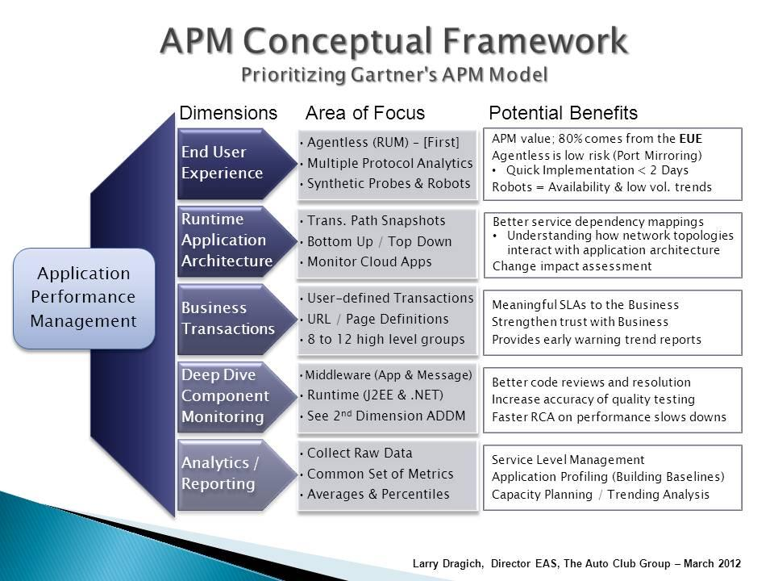

title: Node.js APM 调研及原理分析
speaker: 齐云雷
prismTheme: okaidia

<slide class="bg-blue aligncenter" video="https://embedwistia-a.akamaihd.net/deliveries/93b871eac3d0214e774b186f5165945b244c0fa6/file.mp4 poster='https://embedwistia-a.akamaihd.net/deliveries/430ef83fc694f1ba9f548da1cd8eb56992f7f53d.jpg' .dark">

# Node.js APM 调研及原理分析 {.text-landing.text-shadow}

<!-- By 齐云雷 {.text-intro} -->
<!-- Powered by nodeppt -->

<slide class="bg-black-blue aligncenter">
# APM
---
<div class="size-60 aligncenter">
### [Application Performance Management](https://en.wikipedia.org/wiki/Application_performance_management) 

### 监控服务的一套技术手段，致力于监控并管理程序的性能和可用性
</div>

<slide class="bg-black-blue aligncenter">



<slide class="bg-black-blue aligncenter">
# APM的定义
---
<div class="size-80 aligncenter" style="font-size:30px">
- 终端用户体验
<!-- 反馈真实用户的体验，包括高峰时的服务、组件平均响应时间。 -->
- 应用架构映射
<!-- 能否分析真实请求链路。 -->
- 应用事务分析
<!-- 要求有序、完整地记录事务信息，能够定位两个操作是否为同一个用户，且信息具备唯一性。 -->
- 深度应用诊断
<!-- 用户反馈问题时，能精准定位问题点，通常需要做更底层的监控。同时又有着部署简单、副作用低的要求，这是 APM 应用的主要难点所在。 -->
- 分析与报告
<!-- 数据要实时且精准，大数据的存储与查询，目前已经不难应对。 -->
</div>

<slide class="bg-black-blue aligncenter">

#### 2016 年， Gartner 又将上述 5 个维度更新为 3 个新维度。

---
<div class="size-80 aligncenter" style="font-size:30px">
- 数字体验监控 (DEM)
<!-- 对应用户体验监控。实质依然是通过用户的角度分析关键业务（RUM），通过测试消除潜在的错误和性能瓶颈（STM），以数字化增强监控分析能力。 -->
- 应用发现、跟踪、诊断 (ADTD)
<!-- 整合并了应用架构映射、事务分析、深度应用诊断。 -->
- 应用分析 (AA)
<!-- 对应分析与报告。 -->
</div>

<slide class="bg-black-blue aligncenter">
# 市场调研-商业软件
<slide class="bg-black-blue slide-top" image="https://newrelic.com/assets/pages/apm/nodejs/apm-nodejs-transactions-dashboard-ab492ad569f7cc997a2dbdf6921e07f7.png .dark">
# [New Relic](https://newrelic.com/nodejs)
---
:::div {.content-left}
Node.js APM 产业的龙头，虽然监控服务需要付费，数据上传到云端才能使用，但其 Agent 源代码完全开放。

付费用户的首选。 

<slide class="bg-black-blue slide-top" image="https://www.appdynamics.com/media/uploaded-images/1503958536/.thumbnails/node.js-performance-monitoring-figure-6-500x0_q100.png .dark">
# [AppDynamics](https://www.appdynamics.com/nodejs)
---
:::div {.content-left}

专攻企业级服务，支持部署在公司内部数据中心。

其 Agent 代码不完全开放，使用了经过编译的 jar 包和二进制文件。

<slide class="bg-black-blue slide-top" image="https://dt-cdn.net/images/nodejs-heap-memory-analysis-2500-e9e25c6522.png .dark">
# [Dynatrace](https://www.dynatrace.com/technologies/nodejs-monitoring/)
---
:::div {.content-left}

在 Node.js 的市场占有率和热度较低，不开放源代码，无法深度化定制。

<slide class="bg-black-blue slide-top" image="https://www.atatus.com/images/product/apm/pages/apm_dashboard.png .dark">
## [Atatus](https://www.atatus.com/for/nodejs)
---
:::div {.content-left}
支持功能一般，SDK 做了代码混淆。

<slide class="bg-black-blue slide-top" image="https://www.tingyun.com/wp-content/themes/tingyun/images/solu-img2.png .dark">
## [听云](https://doc.tingyun.com/server/html/node/install.html)
---
:::div {.content-left}
部分功能（代码）借鉴自 New Relic，针对国内市场做了一些本地化。

<slide class="bg-black-blue slide-top" image="https://static.oneapm.com/assets/sites2/images/ai/cc1826bd.2-2.png .dark">
## [OneAPM](https://www.oneapm.com/ai/nodejs.html)
---
:::div {.content-left}
定位类似听云。

<slide class="bg-black-blue aligncenter">
# 市场调研-开源/免费软件

<slide class="bg-black-blue slide-top" image="https://img.alicdn.com/tfs/TB1_idMa3MPMeJjy1XdXXasrXXa-1358-803.png .dark">
# [Alinode](https://cn.aliyun.com/product/nodejs)
---

:::div {.content-left}

Runtime？

数据安全？

争议较大...

<slide class="bg-black-blue slide-top" image="https://img.alicdn.com/tfs/TB1_idMa3MPMeJjy1XdXXasrXXa-1358-803.png .dark">
# [Alinode](https://cn.aliyun.com/product/nodejs)
---

:::div {.content-left}
Alinode 对 Node Runtime 增加了哪些改动？

• 增加了一些 V8 没有对外暴露的接口，比如 GC Trace 来动态输出 GC 日志

• 埋了一些点以性能损耗更低的方式采集进程级别的 CPU 和 Memory 数据

• 增加了动态开启 CPU / Memory / GC 状态采集的开关


> 对于负责开发者业务相关的 API 和功能逻辑，并无任何改动，AliNode 和官方的 Runtime 可以无缝对切的原因。

<slide class="bg-black-blue slide-top" image="https://img.alicdn.com/tfs/TB1_idMa3MPMeJjy1XdXXasrXXa-1358-803.png .dark">
# [Alinode](https://cn.aliyun.com/product/nodejs)
---

:::div {.content-left}
**安全问题**

主要是担心会采集业务数据上报，但是实际上 AliNode 内核的上述改动，都不会直接向云端发送任何数据，而都是以本地 Log 的方式写入大家配置的 NODE_LOG_DIR 目录下，日志文件以 `node-日志.log` 的形式命名。

控制台看到的数据均是通过 agentx 这个库采集上报的，这个库是开源的。

<slide class="bg-black-blue slide-top" image="https://static.cnodejs.org/FnYogKudNxd92qVSZ19cl3e4dWF5 .dark">
# [Easy Monitor](https://github.com/hyj1991/easy-monitor)
---

:::div {.content-left}

功能相对简单，仅提供性能监控与分析，维护度较低。

目前最大的价值是作为学习项目，而不是投入生产环境。

<slide class="bg-black-blue slide-top" image="https://img.alicdn.com/tfs/TB1k04KhY_I8KJjy1XaXXbsxpXa-2540-1996.png .dark">
# [Pandora.js](https://midwayjs.org/pandora/zh-cn/)
---

:::div {.content-left}

来自淘宝 midwayjs 团队的进程启动器，阿里内部已经落地，正在重构 2.0 版本。

目前不支持平滑重启，Dashboard 只能单机部署单机监控，无法集群监控，midway 的使用方案是结合 ElasticSearch。

<slide class="bg-black-blue slide-top" image="https://prometheus.io/assets/grafana_prometheus.png .dark">
# [Prometheus](https://prometheus.io/)
---
:::div {.content-left}
在国外非常流行，相比业务方，更多地被运维熟知，是一种监控和报警的开源生态。Agent 和界面有多重组合方式，Node.js 一般结合 `prom-client`(非官方 npm 包) + `Granfana` 使用。

只做性能采集，不支持 trace 跟踪。目前已知缺陷是内存占用较高和日志量巨大，数据可以选择本地存储或远程接口存储。

开源的一大选择方案，落地可能对运维团队要求较高

<slide class="bg-black-blue slide-top" image="https://static-www.elastic.co/v3/assets/bltefdd0b53724fa2ce/blte0af23fc549e1e02/5ca6865b154fe31d3366fa5e/apm-animation-opbeans-python-app.gif .dark">
# [Elastic APM](https://www.elastic.co/solutions/apm)
---

:::div {.content-left}
Elastic 体系下的完全开源的 APM 解决方案，也提供商业付费服务。

apm-server ElasticSearch，Kibana 内置了 APM 基础看板。

官方提供 API 来支持深度定制，golang 降低了二次开发的成本，更不用担心 Kibana 看板功能不够用。总之，是相当全面的解决方案。

<slide class="bg-black-blue aligncenter">
# 选型概述

<slide class="bg-black-blue slide-top">
# 主要维度
---
<div style="font-size:24px">
:::flexblock
• 性能监控

---
• 代码级监控

---
• 事务监控

---
• 框架支持

---
• 链路追踪

---
• 分布式部署

---
• 代码侵入

---
• 社区活跃度

---
• 数据安全

---
• 外部依赖

</div>

<slide class="bg-black-blue aligncenter">

|名称|Express|Koa|性能|代码级|事务|链路|分布式|侵入|实现方式|npm周下载量(+)|
|-|-|-|-|-|-|-|-|-|-|-|
|newrelic     |✓|✓|✓|✓|✓|✓|✓|低|探针|30.1k|
|appdynamics  |✓|✓|✓|✓|✓|✓|✓|低|探针|9.5k|
|dynatrace    |✓|✓|✓|✓|✓|✓|✓|低|探针|0.1k|
|atatus       |✓|✓|✓|×|✓|✓|✓|低|探针|0.6k|
|tingyun      |✓|✓|✓|✓|✓|✓|✓|低|探针|0.3k|
|one apm      |✓|×|✓|✓|✓|✓|✓|低|探针|0.1k|
|alinode      |✓|✓|✓|✓|✓|✓|✓|无|run time|-|
|easy monitor |✓|✓|✓|×|×|×|✓|低|探针|0.1k|
|pandora      |✓|✓|✓|×|✓|✓|×|极低|进程启动器|0.2k|
|Prometheus   |✓|✓|✓|×|✓|✓|✓|低|探针|20.1k|
|elastic apm  |✓|✓|✓|✓|✓|✓|✓|低|探针|24.6k

<slide class="bg-black-blue aligncenter">
# Elastic APM

<slide class="bg-black-blue slide-top">
# 项目背景
---
:::div {.content-left}
2011 年 11 月开工，至今基本都是单人维护的状态。

两任作者：

- Matt Robenolt, @Sentry core member 

- Thomas Watson, @Elastic Node.js dev, @Node.js core member

<slide class="bg-black-blue slide-top">
# 文档建设
:::div {.content-left}
---
- [APM](https://www.elastic.co/guide/en/apm/get-started/current/index.html)\: https\://www.elastic.co/guide/en/apm/get-started/current/index.html
- [Node Agent](https://www.elastic.co/guide/en/apm/agent/nodejs/current/index.html)\: https\://www.elastic.co/guide/en/apm/agent/nodejs/current/index.html
- [Kibana APM](https://www.elastic.co/guide/en/kibana/current/xpack-apm.html)\: https\://www.elastic.co/guide/en/kibana/current/xpack-apm.html

---
一如 Elastic 其他技术栈，官方文档是相当细致了，使用前推荐阅读一遍。

<slide class="bg-black-blue slide-top">
# 基本功能
:::div {.content-left}
---
- 自定义 Node.js 框架和路由。
- 上报错误 stack，支持 source map 。
- 支持采集 http 请求的 body 参数（默认关闭）。
- 过滤敏感信息，根据请求头、或自定义维度。
- 定制上报 Transaction、Span、额外的 Custom 数据。
- 性能优化：调整采样率、上报频率、请求体的限制。
- opentracing
- kubernetes
- [...](http://apm.guahao.cn/app/kibana)

<slide class="bg-black-blue slide-top">
# 数据上报
---
:::div {.content-center}
<br>
<br>
``` {.animated.fadeInUp}
elastic-apm-node(node)  ➡   apm-server(golang)
                                   ⬇
     kibana(展示层)      ➡   elasticsearch(数据层)
```

<slide class="bg-black-blue slide-top">
# 目录结构
---
:::div {.content-center}

- lib
  - filters
  - instrumentation
    - module
  - metrics
    - platform
  - middleware

<slide class="bg-black-blue slide-top">
# 核心功能
---
:::div {.content-center}

#### Transaction
---
#### Error
---
#### Metric
---

<slide class="bg-black-blue slide-top">
# Error
:::div {.content-center}

```js
var formatter = require('./lib/node-0.10-formatter')

var orig = Error.prepareStackTrace
Error.prepareStackTrace = function (err, callsites) {
  Object.defineProperty(err, '__error_callsites', {
    enumerable: false,
    configurable: true,
    writable: false,
    value: callsites
  })

  return (orig || formatter)(err, callsites)
}

module.exports = function (err) {
  err.stack
  return err.__error_callsites
}
```
<slide class="bg-black-blue slide-top">
# Error
:::div {.content-center}

```js
Error.prepareStackTrace(error, structuredStackTrace)
```

这个接口常常被用来格式化错误信息，`structuredStackTrace` 包含了一组 CallSite 对象，CallSite 对象支持的方法有：

getThis, getTypeName, getFunction, getFunctionName, getMethodName, getFileName, getLineNumber, getColumnNumber, getEvalOrigin, isToplevel, isEval, isNative, isConstructor, isAsync, isPromiseAll, getPromiseIndex

借助 CallSite 可以拿到 Error 抛出的文件、行列位置。
<slide class="bg-black-blue aligncenter">
# Metric

<slide class="bg-black-blue slide-top">
# Metric概述
---
:::div {.content-center}

一般来说，Node.js 原生暴露的接口足够对进程性能的基本状况有所判断了，但 APM 系统总是希望监控更详细的信息。尤其是系统 CPU、内存占用率的走势图。一部分探针选择用纯 JS 计算，另一部分探针选择使用 C++ 获取/计算。使用 C++ 的库一般还会获取更复杂的指标，如 [appmetrics](https://github.com/RuntimeTools/appmetrics) 会获取一部分 GC、Event loop 信息。

<slide class="bg-black-blue slide-top">
# Elastic Metric
---
:::div {.content-center}

- /proc/meminfo\: 记录系统内存信息，用来获取两个指标：MemAvailable 和 MemTotal。对应 `os.totalmem()` 和 `os.freemem()`。
- /proc/stat\: 记录 CPU 活动信息，用来获取两个指标：cpuTotal 和 cpuUsage。这一步用 Node.js 计算略麻烦，需要定时缓存 `os.cpus()` 的 `times.total` `times.idle`指标。
- /proc/self/stat\: 不同于前面两个记录系统级信息的文件，此文件记录了当前进程的所有活动信息。用来获取进程 CPU 使用率和 RSS 内存。对应 `processTop.cpu().percent / cpus.length` 和 `process.memoryUsage().rss`。

<slide class="bg-black-blue slide-top">
# Transaction概述
---
:::div {.content-center}
Elastic APM 中的事务，类似于 opentracing 中的 Span，但把一个请求中所有的 Span 抽象为一个概念。Transaction 实现的基础是各种代码钩子。

<slide class="bg-black-blue slide-top">
# Patch
---
:::div {.content-center}
```js
// koa
module.exports = function (koa, agent, { version, enabled }) {
  if (!enabled) return koa

  agent.setFramework({ name: 'koa', version, overwrite: false })

  return koa
}
```

<slide class="bg-black-blue slide-top">
```js
// koa-router
// 配合 require-in-the-middle 模块食用
shimmer.wrap(Router.prototype, 'match', function (orig) {
  return function (_, method) {
    var matched = orig.apply(this, arguments)

    if (typeof method !== 'string') {
      agent.logger.debug('unexpected method type in koa-router prototype.match: %s', typeof method)
      return matched
    }

    if (Array.isArray(matched && matched.pathAndMethod)) {
      const layer = matched.pathAndMethod.find(function (layer) {
        return layer && layer.opts && layer.opts.end === true
      })

      var path = layer && layer.path
      if (typeof path === 'string') {
        var name = method + ' ' + path
        agent._instrumentation.setDefaultTransactionName(name)
      } else {
        agent.logger.debug('unexpected path type in koa-router prototype.match: %s', typeof path)
      }
    } else {
      agent.logger.debug('unexpected match result in koa-router prototype.match: %s', typeof matched)
    }

    return matched
  }
})
```

<slide class="bg-black-blue slide-top">
# async-hook
:::div {.content-center}

```js
// 基于 async-hook 封装了 Instrumentation 的 `currentTransaction` 方法
// 使异步操作中随时可以拿到当前 async scope id 下的 Transaction 实例。
const asyncHooks = require('async_hooks')
module.exports = function (ins) {
  const asyncHook = asyncHooks.createHook({ init, before, destroy })
  const contexts = new WeakMap()

  const activeTransactions = new Map()
  Object.defineProperty(ins, 'currentTransaction', {
    get () {
      const asyncId = asyncHooks.executionAsyncId()
      return activeTransactions.get(asyncId) || null
    },
    set (trans) {
      const asyncId = asyncHooks.executionAsyncId()
      if (trans) {
        activeTransactions.set(asyncId, trans)
      } else {
        activeTransactions.delete(asyncId)
      }
    }
  })
  // ...
}
```

<slide class="bg-black-blue slide-top">
# async-hook
```js
// 下面是 currentTransaction 的一处应用
Instrumentation.prototype.bindFunction = function (original) {
  if (typeof original !== 'function' || original.name === 'elasticAPMCallbackWrapper') return original

  var ins = this
  var trans = this.currentTransaction
  var span = this.currentSpan
  if (trans && !trans.sampled) {
    return original
  }

  return elasticAPMCallbackWrapper

  function elasticAPMCallbackWrapper () {
    var prevTrans = ins.currentTransaction
    ins.currentTransaction = trans
    ins.bindingSpan = null
    ins.activeSpan = span
    if (trans) trans.sync = false
    if (span) span.sync = false
    var result = original.apply(this, arguments)
    ins.currentTransaction = prevTrans
    return result
  }
}
```

<slide class="bg-black-blue slide-top">
# async-hook
---

:::div {.content-center}

- async hook 是 Node.js 8 以后出现的概念，为了兼容旧版本，Elastic APM 借助 `async-listener` 模块做了一些兼容，尽管 Elastic APM 官方不推荐使用低版本 Node.js 接入。

- 虽然 async hook 更进一步可以帮助优化异步调用栈，改善异步 Error 信息的可读性，但 APM 很难从底层判断哪些异步 CallSite 是用户想保留的，所以没有做这种处理。

<slide class="bg-black-blue slide-top">
# Stack Trace
---
:::div {.content-center}
- Span 用来记录 database、http、websocket 等细致操作，Elastic APM 同时还记录了调用栈。

- 通常我们用 console.trace、Error 定位调用栈，实际上他们都使用来自 V8 的方法，在 Node.js 中也可以直接调用 —— `Error.captureStackTrace(error, constructorOpt)`

```js
// error 是记录 trace 的必传对象，trace 字符串将附加到对象的 stack 属性上
// constructorOpt 是用来隐藏底层调用栈的可选函数，用法如下

function MyError() {
  Error.captureStackTrace(this, MyError);
  // Any other initialization goes here.
}
```

<slide class="bg-black-blue slide-top">
# 小插曲
---
:::div {.content-center}
- 上面提到的 V8 Error trace API，结合 TJ 的 `callsite` 更容易理解，功能是获取当前的 CallSite 集合。

```js
module.exports = function(){
  var orig = Error.prepareStackTrace;
  Error.prepareStackTrace = function(_, stack){ return stack; };
  var err = new Error;
  Error.captureStackTrace(err, arguments.callee);
  var stack = err.stack;
  Error.prepareStackTrace = orig;
  return stack;
};
```

<slide class="bg-black-blue aligncenter">
# 踩过的坑...

<slide class="bg-black-blue aligncenter">
# Thank you!
